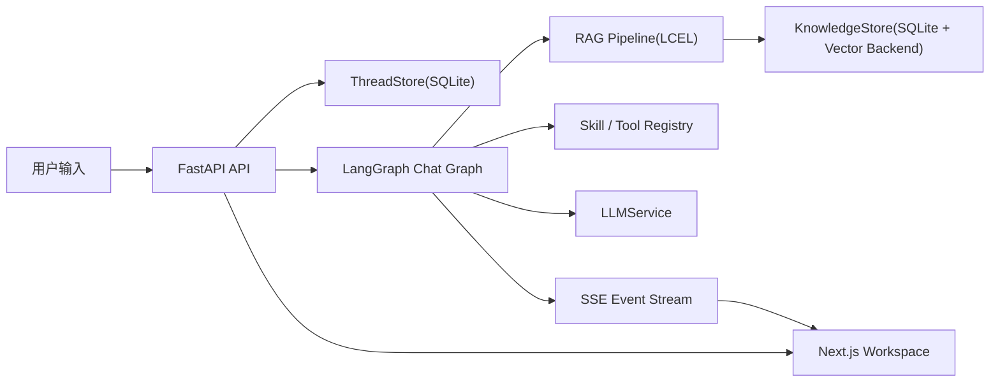

# LangChain Learning Demo

这是一个**边做边学**的 Agent 学习项目，目标不是只把 Agent 跑起来，而是把下面这些能力都拆成你能看懂、能扩展、能继续练习的代码：

- 会话式 Agent
- 巡检 Agent（定时自动化）
- LangGraph 状态编排
- Skill / Tool 能力体系
- RAG 知识库
- Streaming 事件流
- LangSmith tracing（可选增强）

项目现在已经从旧版“串行 workflow demo”升级成：

- 后端：`FastAPI + LangChain + LangGraph`
- 前端：`Next.js App Router + TypeScript + Tailwind`
- 存储：`SQLite`
- 知识库：`SQLite + Chroma` 的 Hybrid RAG（lexical + vector）

---

## 1. 项目目标

这个项目优先解决两个问题：

1. **能学**
   - 关键模块都有注释
   - README 和 `docs/` 可以直接当学习笔记
   - LangChain 的重点能力都能在代码里找到落点

2. **能跑**
   - 不依赖外部模型也能进入“学习模式”
   - 可以创建会话、发送消息、看工具轨迹、上传文档、体验 RAG
   - 如果配置 OpenAI / Ollama 等 provider，可切到真实模型

---

## 2. 技术选型与为什么选它

### 后端

- `FastAPI`
  - 适合快速搭 API、SSE、文件上传接口
- `LangChain`
  - 用来承载 Prompt / Messages / Tools / Structured Output / Runnable
- `LangGraph`
  - 用来承载会话状态、节点路由、工具调用和 RAG 分支
- `SQLite`
  - 简单直接，方便你理解“Thread State 持久化”是什么

### 前端

- `Next.js App Router`
  - 用更现代的 React 结构组织聊天工作台
- `TypeScript`
  - 前后端类型更清晰
- `Tailwind CSS`
  - 快速搭一个可展示的学习工作台

---

## 3. 架构图



---

## 4. 目录结构

```text
agentDemo/
├─ backend/
│  ├─ app/
│  │  ├─ main.py
│  │  ├─ settings.py
│  │  ├─ schemas.py
│  │  ├─ registry.py
│  │  ├─ graphs/chat_graph.py
│  │  ├─ graphs/watcher_graph.py
│  │  ├─ rag/pipeline.py
│  │  ├─ services/
│  │  │  ├─ chat_service.py
│  │  │  ├─ knowledge_store.py
│  │  │  ├─ llm_service.py
│  │  │  ├─ thread_store.py
│  │  │  ├─ watcher_store.py
│  │  │  ├─ watcher_service.py
│  │  │  └─ watcher_scheduler.py
│  │  └─ skills/learning.py
│  └─ requirements.txt
├─ frontend/
│  ├─ app/
│  ├─ components/
│  ├─ lib/
│  └─ package.json
├─ docs/
│  ├─ architecture.md
│  ├─ langchain-learning-map.md
│  ├─ rag.md
│  └─ skills.md
└─ README.md
```

---

## 5. 快速启动

### 后端

```bash
cd /Users/wangyahui/yonyou/AI工具/agentDemo/backend
python -m venv .venv
source .venv/bin/activate
pip install -r requirements.txt
uvicorn app.main:app --reload --port 8000
```

### 前端

```bash
cd /Users/wangyahui/yonyou/AI工具/agentDemo/frontend
npm install
npm run dev
```

打开：

- 前端：[http://localhost:3000](http://localhost:3000)
- 后端接口：[http://127.0.0.1:8000](http://127.0.0.1:8000)

### 巡检 Agent 相关环境变量（可选）

如果你要真正打通“自动分配 + 邮件通知”，还需要补这些环境变量：

```bash
export WATCHER_ASSIGNMENT_API_URL="https://your-company.example.com/assign"
export WATCHER_ASSIGNMENT_API_TOKEN="your-token"

export WATCHER_SMTP_HOST="smtp.example.com"
export WATCHER_SMTP_PORT="587"
export WATCHER_SMTP_USERNAME="bot@example.com"
export WATCHER_SMTP_PASSWORD="password"
export WATCHER_SMTP_USE_TLS="true"
export WATCHER_SMTP_USE_SSL="false"

export WATCHER_SCHEDULER_INTERVAL_SECONDS="15"
```

现在推荐优先使用工作台里的：

- `设置 -> 模型设置`
- `设置 -> 邮箱设置`

只有在你**还没保存全局邮箱配置**时，系统才会继续 fallback 到上面的 `WATCHER_SMTP_*`。

如果不配置这些变量，也不在工作台里保存邮箱配置：

- 巡检 Agent 仍然可以创建、保存、抓取和解析面板
- 但“调用分配接口 / 发邮件”会在运行记录里明确标记失败原因
- 这正好方便你学习链路而不被外部基础设施卡住

---

## 5.1 全局模型设置中心

这一版新增了一个**全局 provider 配置中心**：

- 入口在左侧工作台**左下角 `设置`**
- 点开后选择 `模型设置`
- 进入一个双栏面板：
  - 左侧是 provider 列表
  - 右侧是当前 provider 的配置表单

### 为什么要单独做一个设置中心

因为现在系统把“模型配置”拆成了两层：

- `ModelConfig`
  - 只保存 `provider + model + temperature + max_tokens`
  - 这是线程、检索模式、Agent 运行时引用的轻量配置
- `ProviderConfig`
  - 保存 `API Key`、`Base URL`、`协议格式`、`模型列表`
  - 这是全局共享真源

这样做的好处是：

- 线程和 Agent 不再重复保存密钥
- 改一次 provider 设置，Chat / 检索模式 / 我的 Agent 会自动共用
- 更适合学习“运行参数引用”和“全局连接配置”的区别

### provider / protocol / model 三者关系

- `provider`
  - 是一个全局配置实体，例如 `openai`、`ollama`、`minimax`
- `protocol`
  - 定义这个 provider 走哪种兼容格式：
  - `openai_compatible`
  - `anthropic_compatible`
  - `ollama_native`
  - `mock_local`
- `model`
  - 是 provider 下的一个可选模型项，例如 `gpt-4.1-mini`、`MiniMax-M2.5`

你可以把它理解成：

```text
provider = 连接方式与凭据
protocol = 请求格式
model = 具体要跑哪个模型
```

### 如何接入真实 OpenAI / Ollama / 兼容厂商

#### OpenAI

1. 打开 `设置 -> 模型设置`
2. 选择 `OpenAI`
3. 填：
   - `API Key`
   - `API Base URL = https://api.openai.com/v1`
4. 点击 `测试连接`
5. 在 Chat / 检索模式 / 我的 Agent 里选择 `OpenAI` 和对应模型

#### Ollama

1. 本地先启动 Ollama
2. 打开 `设置 -> 模型设置`
3. 选择 `Ollama`
4. 确认 `API Base URL = http://127.0.0.1:11434`
5. 点击 `测试连接`
6. 若本地已有模型，会自动出现在模型列表里

#### 自定义 OpenAI / Anthropic 兼容厂商

预置了两个 provider：

- `custom_openai`
- `custom_anthropic`

使用方式：

1. 选择其中一个
2. 填写厂商给你的 `API Key`
3. 填写兼容接口的 `Base URL`
4. 手动添加模型，或者先点 `测试连接`

### MiniMax 最小案例

如果你想按 MiniMax 的方式配置：

1. 打开 `设置 -> 模型设置`
2. 选择 `MiniMax`
3. 根据你拿到的接口格式，选择：
   - `OpenAI 兼容`
   - 或 `Anthropic 兼容`
4. 填 `API Key`
5. 把 `API Base URL` 设成你实际要用的地址
6. 手动添加模型，例如：
   - 显示名：`MiniMax M2.5`
   - 模型 ID：`MiniMax-M2.5`
7. 保存后，去 `Chat` 里选择 `MiniMax / MiniMax-M2.5`
8. 发送一个问题，观察它是否走真实 provider

### 这部分代码建议怎么看

如果你准备顺着链路学习，推荐按这个顺序看：

1. `backend/app/services/provider_store.py`
2. `backend/app/services/llm_service.py`
3. `frontend/components/model-settings-provider.tsx`
4. `frontend/components/model-settings-panel.tsx`
5. `frontend/components/model-selector.tsx`

## 5.2 全局邮箱设置中心

这一版把“发邮件”也提升成了一个全局设置能力：

- 入口在左侧工作台**左下角 `设置`**
- 点开后选择 `邮箱设置`
- 巡检 Agent 会统一复用这里的 SMTP 配置发通知

### 为什么要做成全局邮箱设置

因为这类配置和模型 provider 很像，都属于“连接外部基础设施”的全局真源：

- 巡检 Agent 只需要关心**收件人是谁**
- 真正的 `SMTP Host / Port / 用户名 / 密码` 应该集中保存在一个地方
- 这样你在学习时也更容易区分：
  - `WatcherAgentConfig`
  - `全局邮箱配置`

### 配置方式

打开 `设置 -> 邮箱设置` 后，填写：

- `SMTP Host`
- `SMTP Port`
- `SMTP 用户名`
- `SMTP 密码`
- `TLS / SSL`

注意：

- **发件邮箱固定等于 SMTP 用户名**
- 巡检 Agent 页面里不再手填发件邮箱
- 每个巡检 Agent 只需要填写 `收件邮箱`

### 测试发信

在 `邮箱设置` 面板里：

1. 先填好 SMTP 配置
2. 在“测试发信”里填一个测试收件邮箱
3. 点击 `测试发信`

系统会：

1. 先保存当前草稿
2. 再用这套配置发一封测试邮件

### 环境变量 fallback 规则

邮箱配置的优先级固定为：

1. 工作台里保存的**全局邮箱设置**
2. 旧的环境变量 `WATCHER_SMTP_*`

所以：

- 如果你已经在工作台里保存了邮箱配置，巡检 Agent 会优先用数据库里的值
- 如果你还没保存过，系统仍然能继续读取环境变量

### 最小案例

1. 打开 `设置 -> 邮箱设置`
2. 配置公司邮箱或测试邮箱 SMTP
3. 点击 `测试发信`，确认能收到测试邮件
4. 回到 `巡检 Agent`
5. 只填写 `收件邮箱`
6. 当巡检发现新增 bug 时，就会自动往这些收件邮箱发通知

---

## 6. 一次完整执行链路

你可以先试这三类学习路径：

### 工具链示例

输入：

```text
报销 3 天 每天 100 含税
```

执行链路：

1. `inspect_request` 路由到 `tool`
2. 调 `calc_money`
3. 调 `calc_tax`
4. 调 `format_breakdown`
5. `finalize_response` 输出 `FinalResponse`
6. 前端显示 tool_start / tool_end / final

### RAG 示例

先上传一份 `.md` 或 `.txt` 文件，然后输入：

```text
请根据文档总结重点
```

执行链路：

1. `inspect_request` 路由到 `rag`
2. `RAGPipeline` 执行 query rewrite → retrieve → context format
3. graph 把 citation 和 context 写回状态
4. `finalize_response` 返回带引用的结构化结果

### 巡检 Agent 学习链路

左侧现在新增了一级导航 `巡检 Agent`，它和 `我的 Agent` 是两类不同的能力：

- `我的 Agent`
  - 面向交互式运行
  - 你手动输入问题，它再调用模型 / Skill / RAG
- `巡检 Agent`
  - 面向定时自动化
  - 后端按轮巡间隔自己抓接口、识别新增 Bug、分配负责人、发邮件

#### 巡检 Agent 的 LangGraph 节点

代码入口：

- `backend/app/graphs/watcher_graph.py`
- `backend/app/services/watcher_service.py`
- `backend/app/services/watcher_store.py`
- `backend/app/services/watcher_scheduler.py`
- `frontend/components/watchers-workspace.tsx`

运行节点顺序固定为：

1. `fetch_dashboard_json`
2. `extract_bug_list`
3. `detect_new_bugs`
4. `match_owner_rules`
5. `llm_assign_fallback`
6. `call_assignment_api`
7. `compose_email`
8. `send_email`
9. `persist_run`

#### 你可以怎么学习这一部分

建议按下面顺序看代码：

1. `backend/app/schemas.py`
   - 先看 `WatcherAgentConfig`、`WatcherRun`、`ParsedBug`、`OwnerRule`
2. `backend/app/services/watcher_store.py`
   - 看“配置 / 运行记录 / 已见 bug”三类状态怎么落到 SQLite
3. `backend/app/graphs/watcher_graph.py`
   - 看 LangGraph 怎么把巡检链路拆成节点
4. `backend/app/services/watcher_service.py`
   - 看抓取 JSON、调分配接口、发邮件这些真实副作用怎么接进去
5. `frontend/components/watchers-workspace.tsx`
   - 看前端怎么把配置页、运行记录和结果区拼起来

#### 一个最小练习案例

你可以先不接真实邮件和分配接口，只做“基线 + 新增识别”练习：

1. 新建一个 `巡检 Agent`
2. `dashboard_url` 填你的 PM Bug JSON API
3. `request_headers` 填鉴权头
4. 模型先选 `Learning Mode`
5. 先点一次 `立即运行`
   - 这次会建立 baseline
   - 不会发邮件
6. 等面板里真的新增一个 `bug_id`
7. 再点一次 `立即运行`
   - 你会看到新增数、负责人匹配结果、邮件发送状态

#### 负责人规则示例

你可以先填这种规则：

```text
负责人 A
- services: 流程
- modules: 审批, 发票
- keywords: 流程, 提交流转

负责人 B
- services: 工作台
- modules: dashboard, 工作台
- keywords: 工作台, 首页, 面板
```

这样你就能直观看到：

- 为什么有些 Bug 会直接命中规则
- 为什么有些 Bug 会落到 `llm_assign_fallback`
- 为什么“规则主导 + LLM 兜底”比纯模型判断更稳定

---

## 7. LangChain 学习重点映射

这个项目刻意把一些 LangChain 重点技能都放进来了：

- **Prompt / Messages**
  - 位置：`backend/app/services/llm_service.py`
- **Structured Output**
  - 位置：`backend/app/schemas.py` 中的 `FinalResponse`
- **Tool / Structured Tool**
  - 位置：`backend/app/skills/learning.py`
- **Runnable / LCEL**
  - 位置：`backend/app/rag/pipeline.py`
- **LangGraph**
  - 位置：`backend/app/graphs/chat_graph.py`
- **Memory / Thread State**
  - 位置：`backend/app/services/thread_store.py`
- **RAG + Citation**
  - 位置：`backend/app/services/knowledge_store.py`
- **Streaming**
  - 位置：`backend/app/services/chat_service.py`
- **LangSmith**
  - 位置：`rag_retrieve` / `final_response_generation` traceable 节点

详细说明见：

- `docs/langchain-learning-map.md`

---

## 8. 从旧 workflow 到 LangGraph

旧版 demo 的核心执行方式是：

- 维护一个 workflow 数组
- 按顺序 `for step in workflow`
- 每一步结果回写 `context`

这种方式适合入门，但它有几个限制：

- 不适合多轮会话
- 不适合分支路由
- 不适合 RAG / Tool / Chat 混合逻辑
- 很难流式展示每一步过程

新版改成 LangGraph 后：

- 路由是节点
- RAG 是节点
- Tool 执行是节点
- FinalResponse 生成也是节点
- Thread State 明确保存在线程里

---

## 9. 如何新增一个 Tool

在 `backend/app/skills/learning.py` 里加一个新的 `@tool`：

```python
@tool("hello_tool")
def hello_tool(name: str) -> str:
    return f"hello {name}"
```

然后把它加入某个 Skill 的 `tools=[...]` 注册列表里。

建议新增后同步做两件事：

1. 在 `docs/skills.md` 里写下它属于哪个 Skill
2. 在 graph 里决定什么时候触发这个 Tool

---

## 10. 如何新增一个 Skill

Skill 是教学型能力单元，不只是 Tool 列表。

你需要定义：

- `id`
- `name`
- `description`
- `category`
- `tools`
- `learning_focus`

示例位置：

- `backend/app/skills/learning.py`

---

## 11. 如何接入一个知识文档

前端工作台右侧有上传入口，当前通过 JSON + base64 上传，兼容本地学习模式。

支持格式：

- `.txt`
- `.md`
- `.pdf`
- `.docx`

说明：

- `pdf` 需要 `pypdf`
- `docx` 需要 `python-docx`
- 没有这些依赖时，文档状态会进入 `error` 并显示错误信息

---

## 12. 如何查看 LangSmith trace

如果你配置了 LangSmith 环境变量，例如：

```bash
export LANGSMITH_TRACING=true
export LANGSMITH_API_KEY=your_key
export LANGSMITH_PROJECT=langchain-learning-demo
```

你会在以下节点看到 trace：

- `rag_retrieve`
- `final_response_generation`

这很适合学习：

- 一次请求到底经过了哪些步骤
- 检索是否命中了你想要的片段
- Prompt / output schema 是否符合预期

---

## 13. 当前默认行为

为了保证“边做边学”，项目现在采用这些默认值：

- 默认模型：`mock / learning-mode`
- 默认开启全部内置 Skill
- 默认持久化：`SQLite`
- 默认知识库后端：本地学习模式；如果装好 Chroma 依赖，可自动启用对应 backend

这意味着你**即使没有配置 OpenAI / Ollama，也能先完整体验流程**。

---

## 14. 推荐学习顺序

建议按这个顺序阅读代码：

1. `backend/app/schemas.py`
2. `backend/app/skills/learning.py`
3. `backend/app/services/thread_store.py`
4. `backend/app/rag/pipeline.py`
5. `backend/app/graphs/chat_graph.py`
6. `backend/app/services/chat_service.py`
7. `frontend/components/chat-workspace.tsx`

然后再读：

- `docs/architecture.md`
- `docs/langchain-learning-map.md`
- `docs/rag.md`
- `docs/skills.md`

---

## 15. 后续扩展建议

你可以继续往下做这些练习：

- 接入真实 OpenAI / Ollama 聊天模型
- 把 `search_knowledge_base` 也接进自动 Tool 选择
- 增加“人审中断”节点
- 增加多 Agent：Planner / Executor / Reviewer
- 把 SQLite checkpointer 升级成 Postgres 持久化

---

## 16. 备注

当前实现优先级是：

1. 学习体验
2. 结构清晰
3. 功能闭环
4. 再考虑生产化增强

所以这不是一个“已经产品化”的平台，而是一个**适合长期边做边学的 LangChain 项目骨架**。

---

## 11. RAG 工作台 2.0

当前工作台已经升级为 3 个一级模块：

- `Chat`
  - 保留多轮会话、Skill 勾选、模型配置、工具轨迹和流式事件
- `检索模式`
  - 支持知识树
  - 支持目录上传保留相对路径
  - 支持手动建节点后继续上传文件
  - 支持 `global` / `tree_recursive` 两种检索范围
  - 返回 `citations + retrieval_context + summary`
- `我的 Agent`
  - 支持配置名称、描述、system prompt、模型、skills、知识范围
  - 保存后可作为独立入口运行

### 新增后端接口

- `GET /api/knowledge/tree`
- `POST /api/knowledge/tree/nodes`
- `POST /api/knowledge/tree/upload-directory`
- `POST /api/knowledge/tree/{node_id}/documents`
- `GET /api/knowledge/tree/{node_id}`
- `POST /api/retrieval/query`
- `GET /api/agents`
- `POST /api/agents`
- `GET /api/agents/{agent_id}`
- `PATCH /api/agents/{agent_id}`
- `POST /api/agents/{agent_id}/run`

### 支持的文档类型

- `txt`
- `md`
- `pdf`
- `docx`
- `xlsx`

其中 `xlsx` 会按 sheet 维度转成文本后再进入 chunk 和检索流程。

---

## 16. 建议的读代码顺序

如果你准备边看边学，推荐按这个顺序读：

1. `backend/app/main.py`
   看清楚系统对外暴露了哪些入口：Chat、检索模式、我的 Agent。
2. `backend/app/services/chat_service.py`
   看请求进入后，线程、知识树、LangGraph、LLM 是怎么被串起来的。
3. `backend/app/graphs/chat_graph.py`
   看 graph 为什么能表达路由、工具调用、检索分支和最终收口。
4. `backend/app/rag/pipeline.py`
   看 LCEL / Runnable 思维是怎么落到 RAG 链路里的。
5. `backend/app/services/knowledge_store.py`
   看知识树、目录上传、chunk metadata、scope 检索是怎么实现的。
6. `frontend/components/chat-workspace.tsx`
   看前端怎么消费 SSE，把 route / tool / retrieval / final 事件显示出来。
7. `frontend/components/retrieval-workspace.tsx`
   看知识树如何驱动 scoped RAG。
8. `frontend/components/agents-workspace.tsx`
   看配置型 Agent 如何把 prompt / model / skills / scope 固化下来。

## 17. 三条主链路

### 13.1 Chat 链路

用户在 `Chat` 页面输入问题后：

1. 前端调用 `POST /api/threads/{thread_id}/messages`
2. `ChatService.stream_message()` 先把 human message 写入 `ThreadStore`
3. 历史消息 + 用户输入进入 `LearningChatGraph`
4. `inspect_request` 决定走 `chat`、`tool` 还是 `rag`
5. graph 边跑边吐出 SSE 事件：
   - `route`
   - `tool_start`
   - `tool_end`
   - `retrieval`
   - `final`
6. 前端 `applyEvent()` 实时消费这些事件并刷新 UI
7. 最终 `assistant message`、`tool_events`、`final_output` 再写回 SQLite

### 13.2 检索模式链路

用户在 `检索模式` 页面发起单次查询后：

1. 选择检索范围：`global` 或 `tree_recursive`
2. 前端调用 `POST /api/retrieval/query`
3. `ChatService.query_retrieval()` 调用 `RAGPipeline.run()`
4. `RAGPipeline` 依次执行：
   - `_rewrite_query`
   - `_retrieve_documents`
   - `_format_context`
5. `KnowledgeStore.search()` 在当前 scope 下执行 Hybrid 检索：
   - lexical 召回
   - vector 召回
   - RRF 融合排序
6. `LLMService.summarize_retrieval()` 基于命中片段生成 `summary`
7. 前端同时展示：
   - 问题
   - summary
   - citations
   - retrieval_context

### 13.3 我的 Agent 链路

用户在 `我的 Agent` 页面运行某个 Agent 后：

1. 先读取 Agent 配置：`system_prompt`、`model_config`、`enabled_skills`、`knowledge_scope`
2. 前端调用 `POST /api/agents/{agent_id}/run`
3. `ChatService.run_agent()` 把这些配置注入 graph 初始状态
4. 如果 Agent 绑定了知识范围，则优先走 `rag` 分支
5. graph 最终输出 `FinalResponse`
6. 前端展示答案、引用和检索上下文

## 18. 可以直接照着跑的学习案例

### 案例 1：先看 Tool 链路

在 `Chat` 输入：

```text
报销 3 天 每天 100 含税
```

你应该重点观察：

- 路由是否进入 `tool`
- 是否依次触发 `calc_money`、`calc_tax`、`format_breakdown`
- 右侧工具轨迹里每一步输入输出是什么
- `final` 事件和最终 `FinalResponse` 长什么样

### 案例 2：看一次最基础的 scoped RAG

1. 去 `检索模式`
2. 在根节点下上传一个目录，里面放几份 `md` / `txt` / `docx` 文件
3. 选择 `当前节点递归范围`
4. 输入：

```text
请总结这个范围里的重点内容
```

你应该重点观察：

- 目录上传后知识树是怎么长出来的
- 命中的 citation 是否都来自当前树范围
- summary 和 retrieval_context 的区别

### 案例 3：比较 global 和 tree_recursive 的差异

1. 先创建两个不同节点，比如：
   - `财务资料`
   - `项目周报`
2. 给两个节点分别上传不同文档
3. 在 `项目周报` 节点下检索同一个问题，分别切换：
   - `global`
   - `tree_recursive`

你应该重点观察：

- `global` 会不会命中其他节点的文件
- `tree_recursive` 是否只返回当前节点范围内的片段
- citation 上的 `tree_path` 有没有帮助你验证范围是否正确

### 案例 4：把配置型 Agent 跑起来

1. 去 `我的 Agent`
2. 创建一个 Agent：
   - `name`: 项目资料助手
   - `system_prompt`: 你是一个项目资料助手，请优先根据绑定知识范围回答
   - `knowledge_scope_type`: `tree_recursive`
   - `knowledge_scope_id`: 选某个项目节点
3. 输入：

```text
这个项目最近有哪些重点事项？
```

你应该重点观察：

- Agent 并没有一套新的引擎，而是复用了同一个 graph
- 不同的只是它把 prompt / scope / skills 预先固定了
- 同一个问题，换不同 Agent，结果会怎么变化

## 19. 深入阅读

- 详细链路说明：`docs/workbench-flow.md`
- 学习案例说明：`docs/examples.md`
