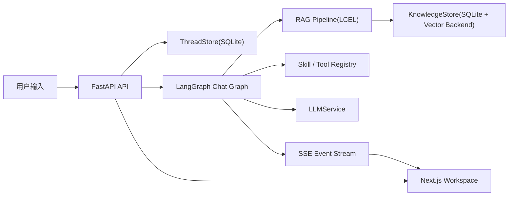

# LangChain Learning Demo

这是一个**边做边学**的 Agent 学习项目，目标不是只把 Agent 跑起来，而是把下面这些能力都拆成你能看懂、能扩展、能继续练习的代码：

- 会话式 Agent
- LangGraph 状态编排
- Skill / Tool 能力体系
- RAG 知识库
- Streaming 事件流
- LangSmith tracing（可选增强）

项目现在已经从旧版“串行 workflow demo”升级成：

- 后端：`FastAPI + LangChain + LangGraph`
- 前端：`Next.js App Router + TypeScript + Tailwind`
- 存储：`SQLite`
- 知识库：默认本地学习模式；安装 `Chroma` 相关依赖后可切换向量库存储

---

## 1. 项目目标

这个项目优先解决两个问题：

1. **能学**
   - 关键模块都有注释
   - README 和 `docs/` 可以直接当学习笔记
   - LangChain 的重点能力都能在代码里找到落点

2. **能跑**
   - 不依赖外部模型也能进入“学习模式”
   - 可以创建会话、发送消息、看工具轨迹、上传文档、体验 RAG
   - 如果配置 OpenAI / Ollama 等 provider，可切到真实模型

---

## 2. 技术选型与为什么选它

### 后端

- `FastAPI`
  - 适合快速搭 API、SSE、文件上传接口
- `LangChain`
  - 用来承载 Prompt / Messages / Tools / Structured Output / Runnable
- `LangGraph`
  - 用来承载会话状态、节点路由、工具调用和 RAG 分支
- `SQLite`
  - 简单直接，方便你理解“Thread State 持久化”是什么

### 前端

- `Next.js App Router`
  - 用更现代的 React 结构组织聊天工作台
- `TypeScript`
  - 前后端类型更清晰
- `Tailwind CSS`
  - 快速搭一个可展示的学习工作台

---

## 3. 架构图



---

## 4. 目录结构

```text
agentDemo/
├─ backend/
│  ├─ app/
│  │  ├─ main.py
│  │  ├─ settings.py
│  │  ├─ schemas.py
│  │  ├─ registry.py
│  │  ├─ graphs/chat_graph.py
│  │  ├─ rag/pipeline.py
│  │  ├─ services/
│  │  │  ├─ chat_service.py
│  │  │  ├─ knowledge_store.py
│  │  │  ├─ llm_service.py
│  │  │  └─ thread_store.py
│  │  └─ skills/learning.py
│  └─ requirements.txt
├─ frontend/
│  ├─ app/
│  ├─ components/
│  ├─ lib/
│  └─ package.json
├─ docs/
│  ├─ architecture.md
│  ├─ langchain-learning-map.md
│  ├─ rag.md
│  └─ skills.md
└─ README.md
```

---

## 5. 快速启动

### 后端

```bash
cd /Users/wangyahui/yonyou/AI工具/agentDemo/backend
python -m venv .venv
source .venv/bin/activate
pip install -r requirements.txt
uvicorn app.main:app --reload --port 8000
```

### 前端

```bash
cd /Users/wangyahui/yonyou/AI工具/agentDemo/frontend
npm install
npm run dev
```

打开：

- 前端：[http://localhost:3000](http://localhost:3000)
- 后端接口：[http://127.0.0.1:8000](http://127.0.0.1:8000)

---

## 6. 一次完整执行链路

你可以先试这两类问题：

### 工具链示例

输入：

```text
报销 3 天 每天 100 含税
```

执行链路：

1. `inspect_request` 路由到 `tool`
2. 调 `calc_money`
3. 调 `calc_tax`
4. 调 `format_breakdown`
5. `finalize_response` 输出 `FinalResponse`
6. 前端显示 tool_start / tool_end / final

### RAG 示例

先上传一份 `.md` 或 `.txt` 文件，然后输入：

```text
请根据文档总结重点
```

执行链路：

1. `inspect_request` 路由到 `rag`
2. `RAGPipeline` 执行 query rewrite → retrieve → context format
3. graph 把 citation 和 context 写回状态
4. `finalize_response` 返回带引用的结构化结果

---

## 7. LangChain 学习重点映射

这个项目刻意把一些 LangChain 重点技能都放进来了：

- **Prompt / Messages**
  - 位置：`backend/app/services/llm_service.py`
- **Structured Output**
  - 位置：`backend/app/schemas.py` 中的 `FinalResponse`
- **Tool / Structured Tool**
  - 位置：`backend/app/skills/learning.py`
- **Runnable / LCEL**
  - 位置：`backend/app/rag/pipeline.py`
- **LangGraph**
  - 位置：`backend/app/graphs/chat_graph.py`
- **Memory / Thread State**
  - 位置：`backend/app/services/thread_store.py`
- **RAG + Citation**
  - 位置：`backend/app/services/knowledge_store.py`
- **Streaming**
  - 位置：`backend/app/services/chat_service.py`
- **LangSmith**
  - 位置：`rag_retrieve` / `final_response_generation` traceable 节点

详细说明见：

- `docs/langchain-learning-map.md`

---

## 8. 从旧 workflow 到 LangGraph

旧版 demo 的核心执行方式是：

- 维护一个 workflow 数组
- 按顺序 `for step in workflow`
- 每一步结果回写 `context`

这种方式适合入门，但它有几个限制：

- 不适合多轮会话
- 不适合分支路由
- 不适合 RAG / Tool / Chat 混合逻辑
- 很难流式展示每一步过程

新版改成 LangGraph 后：

- 路由是节点
- RAG 是节点
- Tool 执行是节点
- FinalResponse 生成也是节点
- Thread State 明确保存在线程里

---

## 9. 如何新增一个 Tool

在 `backend/app/skills/learning.py` 里加一个新的 `@tool`：

```python
@tool("hello_tool")
def hello_tool(name: str) -> str:
    return f"hello {name}"
```

然后把它加入某个 Skill 的 `tools=[...]` 注册列表里。

建议新增后同步做两件事：

1. 在 `docs/skills.md` 里写下它属于哪个 Skill
2. 在 graph 里决定什么时候触发这个 Tool

---

## 10. 如何新增一个 Skill

Skill 是教学型能力单元，不只是 Tool 列表。

你需要定义：

- `id`
- `name`
- `description`
- `category`
- `tools`
- `learning_focus`

示例位置：

- `backend/app/skills/learning.py`

---

## 11. 如何接入一个知识文档

前端工作台右侧有上传入口，当前通过 JSON + base64 上传，兼容本地学习模式。

支持格式：

- `.txt`
- `.md`
- `.pdf`
- `.docx`

说明：

- `pdf` 需要 `pypdf`
- `docx` 需要 `python-docx`
- 没有这些依赖时，文档状态会进入 `error` 并显示错误信息

---

## 12. 如何查看 LangSmith trace

如果你配置了 LangSmith 环境变量，例如：

```bash
export LANGSMITH_TRACING=true
export LANGSMITH_API_KEY=your_key
export LANGSMITH_PROJECT=langchain-learning-demo
```

你会在以下节点看到 trace：

- `rag_retrieve`
- `final_response_generation`

这很适合学习：

- 一次请求到底经过了哪些步骤
- 检索是否命中了你想要的片段
- Prompt / output schema 是否符合预期

---

## 13. 当前默认行为

为了保证“边做边学”，项目现在采用这些默认值：

- 默认模型：`mock / learning-mode`
- 默认开启全部内置 Skill
- 默认持久化：`SQLite`
- 默认知识库后端：本地学习模式；如果装好 Chroma 依赖，可自动启用对应 backend

这意味着你**即使没有配置 OpenAI / Ollama，也能先完整体验流程**。

---

## 14. 推荐学习顺序

建议按这个顺序阅读代码：

1. `backend/app/schemas.py`
2. `backend/app/skills/learning.py`
3. `backend/app/services/thread_store.py`
4. `backend/app/rag/pipeline.py`
5. `backend/app/graphs/chat_graph.py`
6. `backend/app/services/chat_service.py`
7. `frontend/components/chat-workspace.tsx`

然后再读：

- `docs/architecture.md`
- `docs/langchain-learning-map.md`
- `docs/rag.md`
- `docs/skills.md`

---

## 15. 后续扩展建议

你可以继续往下做这些练习：

- 接入真实 OpenAI / Ollama 聊天模型
- 把 `search_knowledge_base` 也接进自动 Tool 选择
- 增加“人审中断”节点
- 增加多 Agent：Planner / Executor / Reviewer
- 把 SQLite checkpointer 升级成 Postgres 持久化

---

## 16. 备注

当前实现优先级是：

1. 学习体验
2. 结构清晰
3. 功能闭环
4. 再考虑生产化增强

所以这不是一个“已经产品化”的平台，而是一个**适合长期边做边学的 LangChain 项目骨架**。
