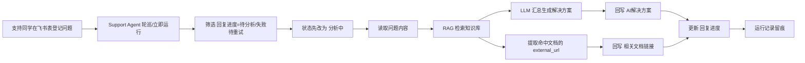

# 支持问题 Agent 演示稿

## 1. 一句话介绍

`支持问题 Agent` 是一个把 **飞书多维表格、知识库检索、AI 总结、定时轮巡、结果回写** 串起来的自动化助手。

它的目标不是替代支持同学，而是把“**重复查资料、整理答案、补链接、更新台账状态**”这部分高频动作自动化。

---

## 2. 它能解决什么问题

我们部门日常会收到很多支持类问题，过去的处理方式通常是：

1. 人工在群里、文档里、知识库里来回找资料
2. 人工整理成答复
3. 人工把答复再贴回台账
4. 人工补充相关文档链接
5. 人工维护当前处理进度

这个流程的问题是：

- 重复劳动多
- 响应速度不稳定
- 不同人回答风格不一致
- 知识库内容虽然有，但不容易被及时复用
- 问题台账容易“有人登记、没人跟进”

`支持问题 Agent` 的价值就在这里：

- **把问题收口到统一台账**
- **自动读取待处理问题**
- **基于知识库做检索和总结**
- **自动回写 AI 解决方案**
- **自动补充相关文档链接**
- **自动维护回复进度**

---

## 3. 现在这个 Agent 已经可以做什么

当前版本已经实现了以下能力：

### 3.1 飞书多维表格接入

- 支持填写飞书多维表格地址
- 支持用企业自建应用的 `App ID + App Secret` 做服务端鉴权
- 支持校验这个地址是否真的可读
- 支持拉取前几行数据做预览
- 支持读取表字段列表
- 支持做“编辑验证”（新建一条测试行、更新、删除），验证写权限

### 3.2 支持问题自动处理

- 从飞书表格中筛选 `回复进度 = 待分析 / 失败待重试` 的问题
- 先把状态写成 `分析中`
- 读取“问题”列内容
- 调用系统内部统一的检索链路做 RAG 检索
- 用 LLM 基于检索结果生成 `AI解决方案`
- 从命中的知识文档里提取已配置的线上链接
- 自动回写到 `相关文档链接`
- 最后把状态更新成：
  - `AI分析完成`
  - `无命中`
  - `失败待重试`

### 3.3 手工运行 + 定时轮巡

- 支持手工点一次“立即运行”
- 支持配置轮巡间隔，后端自动按周期运行
- 每次运行都会产出运行记录
- 可以看到本轮读取了多少行、命中了多少行、成功多少、失败多少

### 3.4 和检索模式复用同一条 AI 链路

- 检索页和 Support Agent 不是两套逻辑
- 两者复用同一个 `RetrievalService`
- 所以检索模式看到的“引用片段 / 上下文 / AI 汇总 / 相关文档链接”，和 Agent 回写时使用的是同一套结果来源

---

## 4. 这个 Agent 的核心价值

给领导汇报时，可以把价值概括成 4 句话：

### 4.1 统一入口

支持问题不再散落在群消息、口头沟通、个人笔记里，而是统一登记到飞书多维表格。

### 4.2 自动复用知识

知识库不是“存了就结束”，而是能被 Agent 主动检索并变成实际答复。

### 4.3 提升响应效率

支持同学不需要每次都从零查资料，AI 会先给出第一版方案和相关文档链接。

### 4.4 沉淀标准化流程

从“登记问题 → AI 初步分析 → 人工确认补充 → 完成处理”，流程被固化下来，后续容易扩展成团队级工作台。

---

## 5. 用了什么技术

这部分可以给领导讲“不是简单写了个脚本，而是形成了平台能力”。

### 5.1 前端

- `Next.js + React + TypeScript`
- 提供 Support Agent 的配置页、调试页、运行记录页

### 5.2 后端

- `FastAPI + Python`
- 提供飞书接入、RAG 检索、Agent 执行、运行记录、轮巡调度等接口

### 5.3 数据存储

- `SQLite`
- 存 Agent 配置、运行记录、平台设置

### 5.4 知识检索

- 基于现有知识库做 `RAG`
- 先检索命中文档，再交给 LLM 汇总
- 每个知识文档支持配置 `external_url`
- 如果某个文档被检索命中，就可以把对应线上链接一起回写

### 5.5 大模型能力

- 支持接入可配置的 LLM Provider
- 检索结果总结和 Support Agent 回写，走统一模型配置
- 可以根据环境切换到真实模型或学习模式

### 5.6 飞书集成

- 使用 **企业自建应用**
- 服务端通过 `tenant_access_token/internal` 获取访问令牌
- 通过飞书多维表格 OpenAPI 完成读表、写表、更新状态

### 5.7 定时调度

- 后端内置 Scheduler
- 到时间自动捞取启用中的 Agent
- 避免依赖外部 cron，平台本身就可以轮巡

---

## 6. 整体工作流程

下面这张图适合直接给领导看：

---

## 7. 在业务上，具体是怎么流转的

### 第一步：人工登记问题

支持同学先在飞书多维表格录入问题。

当前表格里，典型字段包括：

- `问题`
- `登记人`
- `备注（文案或截图）`
- `回复进度`
- `是否重复`
- `支持人员`
- `AI解决方案`
- `相关文档链接`

其中：

- 人工主要填写前面的业务信息
- Agent 重点回写：
  - `AI解决方案`
  - `相关文档链接`
  - `回复进度`

### 第二步：进入待分析状态

只要一条记录的 `回复进度` 是：

- `待分析`
- 或 `失败待重试`

Support Agent 就会把它识别为待处理数据。

### 第三步：Agent 开始处理

Agent 先把当前行状态改成 `分析中`，表示这条数据正在被处理。

这样做的目的是：

- 防止重复跑
- 让表格里的人能实时看到处理状态

### 第四步：执行知识检索

Agent 读取 `问题` 列内容，把它送到检索链路里。

检索链路会做两件事：

1. 在知识库里找最相关的文档片段
2. 把命中的片段交给 LLM 做总结

### 第五步：生成解决方案

如果命中了有效知识片段，LLM 会生成一段适合直接回写到台账里的 `AI解决方案`。

这个答案不是自由发挥，而是基于检索结果总结出来的，所以可追溯、可解释。

### 第六步：回写相关文档链接

如果命中的知识文档配置了 `external_url`，Agent 会把对应链接回写到 `相关文档链接`。

> 当前这张演示表里的 `相关文档链接` 是飞书 `URL` 类型字段，所以当前版本会回写 **一条最佳链接**。  
> 如果后续改成文本字段，也可以扩展成多条链接。

### 第七步：更新处理状态

最终会回写成以下几种状态之一：

- `AI分析完成`：成功生成并回写
- `无命中`：没有检索到可用知识
- `失败待重试`：执行过程中出错，后续可重新轮巡

### 第八步：保留运行记录

每次执行都会保留运行记录，方便查看：

- 本轮读取了多少行
- 处理了多少行
- 成功多少
- 无命中多少
- 失败多少
- 每一行的处理摘要是什么

这样就不是“黑盒自动化”，而是“**可追踪、可排查、可复盘**”。

---

## 8. 页面上的实际使用步骤

如果你现场演示，我建议按下面顺序来讲。

### 8.1 先讲配置

在 `支持问题 Agent` 页面里，先配置：

- Agent 名称
- 轮巡间隔
- 飞书多维表格地址
- 模型
- 知识范围
- 字段映射

### 8.2 先做连通性验证

在正式运行前，可以先做 4 个检查动作：

1. `验证地址`
   - 校验当前飞书地址能不能读
2. `拉取表格`
   - 直接预览前几行数据，确认连的是正确的表
3. `读取字段`
   - 看当前表有哪些字段，防止字段名写错
4. `编辑验证`
   - 用临时测试行验证当前应用是否具备写权限

### 8.3 再做业务筛选验证

点击 `筛选待分析`，确认系统当前会捞到哪些 `回复进度=待分析` 的数据。

这样就能明确看到：

- 目标问题有没有进入待处理集合
- 当前筛选规则是不是对的

### 8.4 最后执行

有两种执行方式：

- `立即运行`
- `定时轮巡`

运行后可以在右侧看到运行记录。

---

## 9. 你给领导演示时，可以这样讲

下面这段话可以直接拿去讲。

---

### 9.1 开场讲法

我们现在做的不是一个单点脚本，而是一个“支持问题自动分析 Agent”。

它的核心思路是：  
**把支持问题统一登记在飞书多维表格里，然后由系统定时捞取待处理问题，自动调用知识库和大模型，生成第一版解决方案，再把结果回写到表格。**

这样支持同学从“每次手工查资料、整理答案、补链接、改状态”，变成“只需要登记问题、审核 AI 初稿、必要时人工补充”。

---

### 9.2 业务价值讲法

这个能力最直接的价值有三点：

1. **提效**：重复问题不需要反复人工整理
2. **标准化**：回复结构更统一，知识复用率更高
3. **沉淀**：每次处理都在台账里留痕，方便后续复盘和统计

---

### 9.3 技术能力讲法

技术上，这个 Agent 已经打通了四件事：

1. **飞书表格读写**
2. **知识库检索**
3. **大模型总结**
4. **定时轮巡执行**

也就是说，这已经不是“能不能做”的问题，而是已经形成了一个可复用的平台能力。

---

### 9.4 演示动作讲法

我现在演示一条完整链路：

1. 在飞书表里把一条问题状态设成 `待分析`
2. 点击“立即运行”
3. 系统自动把状态改成 `分析中`
4. 后端去知识库检索
5. 生成 `AI解决方案`
6. 自动补充 `相关文档链接`
7. 状态更新成 `AI分析完成`
8. 同时保留本轮运行记录

这就说明它已经具备从“问题输入”到“结果回写”的闭环能力。

---

## 10. 当前版本的边界

给领导讲时，建议主动说明当前边界，这样更专业。

### 10.1 当前更适合“第一版辅助答复”

它擅长：

- 从已有知识里找依据
- 给出第一版解决方案
- 帮助支持同学提速

它不适合完全脱离人工，直接作为最终裁决。

### 10.2 效果依赖知识库质量

如果知识库里没有相关内容，系统会给出 `无命中`，这时仍需要人工补充。

### 10.3 链接能力受字段类型约束

当前演示表的 `相关文档链接` 是飞书 URL 字段，所以当前回写的是 **最佳单条链接**。

如果后面希望一条问题回写多条参考资料，可以把字段改成文本，平台侧即可支持多链接输出。

### 10.4 模型效果和当前模型配置有关

如果用真实模型，回写的是正式 AI 总结。  
如果用学习模式，则更适合演示流程，不代表最终回答质量。

---

## 11. 后续可以继续扩展什么

这部分可以作为“下一阶段规划”来讲。

### 11.1 扩展更多数据源

除了飞书多维表格，后续还可以接：

- 腾讯文档
- Excel 导入
- 工单系统
- Jira / PM 台账

### 11.2 扩展更多技能

后续不只是回答问题，还可以挂更多部门技能：

- SQL 排查脚本
- 日志分析脚本
- Bug 自动分派规则
- Prompt 型分析技能
- Python 工具型技能

### 11.3 从“答复”走向“处理”

当前版本已经能完成“自动分析 + 自动回写”。

下一步可以继续做：

- 自动分类
- 自动指派支持人员
- 自动生成升级建议
- 自动补全知识链接
- 自动触发告警邮件

也就是说，这个平台未来可以从 **支持问题 Agent** 扩展成 **部门级 AI 工作平台**。

---

## 12. 最后一句总结

如果用一句话总结给领导：

> 我们已经把“支持问题登记、知识检索、AI总结、结果回写、轮巡执行”打通成了一个闭环。  
> 当前版本已经可以用于支持台账的自动初步分析，后续可以继续扩展成部门统一的 AI 处理平台。

