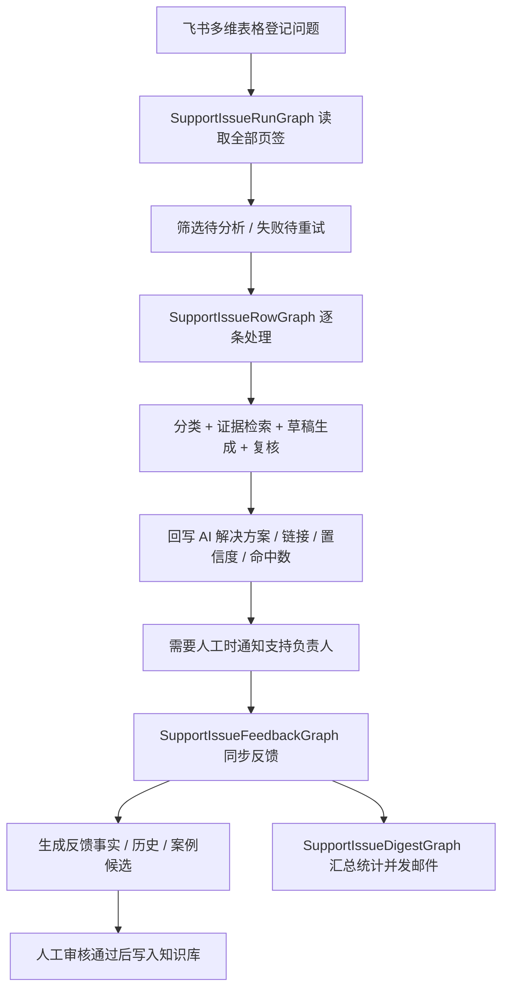

# 支持问题 Agent 当前流程与技术总结

## 1. 一句话介绍

支持问题 Agent 是一套面向真实支持场景的自动化闭环系统：把飞书多维表格里的支持问题，自动接入知识检索、大模型分析、结果回写、人工反馈同步、案例沉淀和周期汇总，形成一条持续可优化的支持处理流程。

## 2. 当前已经打通的完整闭环

目前这套 Agent 已经不是单点问答，而是已经打通了下面这条完整链路：

1. 支持同学在飞书多维表格登记问题
2. Agent 定时轮巡或手动立即运行
3. 系统读取整份多维表格 app 下的多个页签，筛选 `待分析` / `失败待重试` 的记录
4. 单条问题进入 LangGraph 行级处理链路，完成分类、检索、草稿生成、复核、回写
5. 低置信度或无命中的问题自动转 `待人工确认`，并通知对应支持负责人
6. 人工在飞书里补充最终方案、处理结果和备注
7. 系统同步人工反馈，沉淀反馈事实、变更历史和案例候选
8. 审核通过的案例正式写入知识库，供后续问题检索复用
9. 系统定期生成 digest 汇总邮件，输出处理量、采纳率、无命中主题和知识缺口建议

也就是说，它已经形成了一个“问题进入 -> AI处理 -> 人工兜底 -> 经验沉淀 -> 继续反哺 AI”的闭环。

## 3. 端到端完整流程

### 3.1 业务状态流转

一条支持问题从进入到完成，当前是按下面的状态推进：

| 状态 | 含义 |
| --- | --- |
| `待分析` | 新问题进入台账，等待 Agent 处理 |
| `失败待重试` | 上次处理异常，等待下次重跑 |
| `分析中` | Agent 已接手，正在做分类、检索和生成 |
| `AI分析完成` | AI 已生成可直接参考的解决方案并回写 |
| `待人工确认` | 无命中、低置信度或需要人工接管 |
| `人工确认完成` | 人工处理完成，进入最终闭环状态 |

### 3.2 主运行流程

### 3.3 单条问题处理流程

单条支持问题当前会经过以下节点：

1. `prepare_row_context`
   读取问题字段、模块、登记人、来源页签、反馈快照，并先把飞书状态写成 `分析中`
2. `classifier_agent`
   先做问题分类，并校准更适合检索的组合 query
3. `evidence_agent`
   执行支持问题专用 RAG 检索，拿到证据摘要和命中数
4. `draft_agent`
   基于检索结果生成可直接回写到飞书的草稿答案
5. `review_agent`
   判断这条答案能否直接交付，还是应该转人工确认
6. `write_row`
   回写 AI 解决方案、相关文档链接、置信度、命中数和进度状态
7. `notify_support_owner`
   如果无命中或低置信度，则通知对应模块负责人
8. `finalize_row`
   保存这条记录的完整 trace，供前端展示和排查

### 3.4 反馈同步流程

每次 run 结束后，系统都会再执行一轮全表反馈同步：

1. 重新读取整份飞书多维表格的全部页签
2. 把每条记录抽取成结构化 `feedback fact`
3. 和上一次同步快照做对比，判断哪些字段变了
4. 最新结果 upsert 到 SQLite
5. 对变化记录追加反馈历史
6. 对 `待人工确认` 但还没通知支持人的记录做补通知
7. 对首次进入 `人工确认完成` 的记录通知登记人
8. 根据采纳结果和人工最终方案刷新案例候选

### 3.5 案例沉淀流程

当人工处理结果是 `直接采纳` 或 `修改后采纳` 时，系统会把这条记录转成候选案例：

1. 进入 `pending_review` 候选池
2. 在案例审核页面人工编辑最终方案和备注
3. 审核通过后写入正式知识库
4. 后续这类知识会以 `approved_case` 身份参与检索
5. 下一次遇到类似问题时，会优先复用这些已审核案例

### 3.6 汇总流程

Digest 流程会做三件事：

1. 先跑一次最新反馈同步，确保统计口径是新的
2. 统计处理量、AI完成量、待人工确认量、无命中量、失败量、采纳率、驳回率、Top 分类、Top 无命中主题
3. 生成邮件正文并通过 SMTP 发出，同时落库保留 digest 记录和明细项

### 3.7 一个问题的“完成流程”

如果从业务闭环角度看，一条问题完成通常会经过：

1. 问题登记到飞书
2. Agent 自动分析并给出第一版方案
3. 如果答案可信，状态进入 `AI分析完成`
4. 如果答案不够稳，状态进入 `待人工确认`，由负责人接手
5. 人工补充最终答案、处理结果和备注
6. 进度变成 `人工确认完成`
7. 系统通知登记人问题已回复
8. 这次人工处理结果再反哺成事实、案例候选和后续汇总数据

所以这套系统里的“完成”不是“AI生成完就结束”，而是“AI和人工一起把问题真正闭环，并把经验留下来”。

## 4. 用了什么技术

### 4.1 前端

- Next.js 15
- React 19
- TypeScript
- Tailwind CSS

前端提供了支持问题 Agent 的配置、验证、立即运行、反馈同步、digest 查看、案例审核和轨迹展示页面。

### 4.2 后端

- FastAPI
- Pydantic
- asyncio 内置调度器

后端负责 API、调度、飞书读写、模型调用、通知发送、案例入库和统计汇总。

### 4.3 Agent 编排

- LangGraph
- LangChain

当前支持问题 Agent 不是一个大函数，而是拆成四张图：

- `SupportIssueRunGraph`：负责一次完整运行
- `SupportIssueRowGraph`：负责单条问题处理
- `SupportIssueFeedbackGraph`：负责反馈同步和通知检测
- `SupportIssueDigestGraph`：负责统计、邮件生成和发信

### 4.4 AI 与 RAG

- 共享 RAG Pipeline
- Query Bundle 改写
- 多 query 召回
- 结构化 rerank
- 结构化输出分类 / 草稿 / 复核
- 支持问题专用 `retrieval_profile`

当前支持问题场景不是简单相似度检索，而是做了专门提准：

- 根据问题、模块、分类、历史案例生成更适合检索的 query bundle
- 多路召回后做 rerank，筛掉弱相关证据
- 对 `approved_case` 做专项加权
- 复用统一检索链路，和检索工作台保持一致
- 提供 retrieval debug、graph trace 和离线评估脚本，方便持续优化

### 4.5 数据存储

- SQLite：保存 Agent 配置、运行记录、反馈事实、反馈历史、通知日志、案例候选、digest 记录
- ChromaDB：保存知识向量索引
- 知识库文档树：保存正式知识和审核通过后的支持案例

### 4.6 外部集成

- 飞书多维表格：问题台账入口、结果回写入口
- SMTP：digest 汇总邮件
- 用友工作通知：支持负责人通知、登记人完成通知
- 用友联系人查询：把登记人邮箱/账号解析成可通知的用户 ID

## 5. 这套 Agent 的优势

### 5.1 不是单点问答，而是完整闭环

它不是“给个问题回一句答案”，而是把问题登记、AI分析、人工接管、结果回流、案例沉淀、管理汇总串成了一条链路。

### 5.2 不改变业务入口，落地阻力小

业务同学仍然在飞书多维表格里工作，不需要迁移到新系统。AI 是嵌进现有协作流程，而不是要求团队改变习惯。

### 5.3 适合真实支持场景

支持问题处理本来就不是 100% 自动化场景，所以系统天然支持：

- 无命中转人工
- 低置信度转人工
- 通知负责人介入
- 人工结果继续反哺系统

这比只追求“自动回答”更符合真实业务。

### 5.4 会越用越好

人工最终答案、采纳结果和备注不会丢，而是会进入：

- 反馈事实
- 反馈历史
- 候选案例池
- 正式知识库

因此后续同类问题的命中率和答案质量可以持续提升。

### 5.5 可观察、可统计、可复盘

每次 run、每条 row、每次 feedback sync、每次 digest 都有 trace 和记录，可以回答：

- 这次为什么命中
- 为什么转人工
- 哪些问题无命中最多
- 哪些分类最常见
- 人工采纳率和驳回率是多少

这让优化不再靠感觉，而是有数据抓手。

### 5.6 支持多页签统一处理

现在一个 Agent 已经可以处理同一份飞书多维表格 app 下的多个页签，而不是只盯一个默认 table，适合真实业务里按模块拆页签的场景。

## 6. 当前已经完成的能力整理

目前已经完成的能力可以概括为：

- 飞书多维表格接入、字段发现、读写校验、待分析筛选预览
- 多页签统一读取、处理、回写和反馈同步
- 支持问题主运行链路和单行 LangGraph 处理链路
- 支持问题专用 RAG 提准链路
- AI 解决方案回写、相关链接回写、置信度与命中数回写
- 无命中/低置信度转人工确认
- 支持负责人通知和登记人完成通知
- 反馈事实、反馈历史、通知日志落库
- 候选案例生成、人工审核、正式入库
- 立即汇总和周期 digest 邮件
- 洞察统计、运行记录、图执行轨迹展示
- 回归测试和离线评估脚本

## 7. 分享时可以直接说的一段话

我们现在做的这个支持问题 Agent，不只是一个 AI 问答工具，而是把飞书问题台账、知识检索、大模型分析、结果回写、人工反馈、案例沉淀和管理汇总打通成了一个完整闭环。它的价值不只是帮我们自动生成第一版答案，更重要的是把支持工作的经验和流程沉淀下来，让系统能越跑越准、越用越强。
